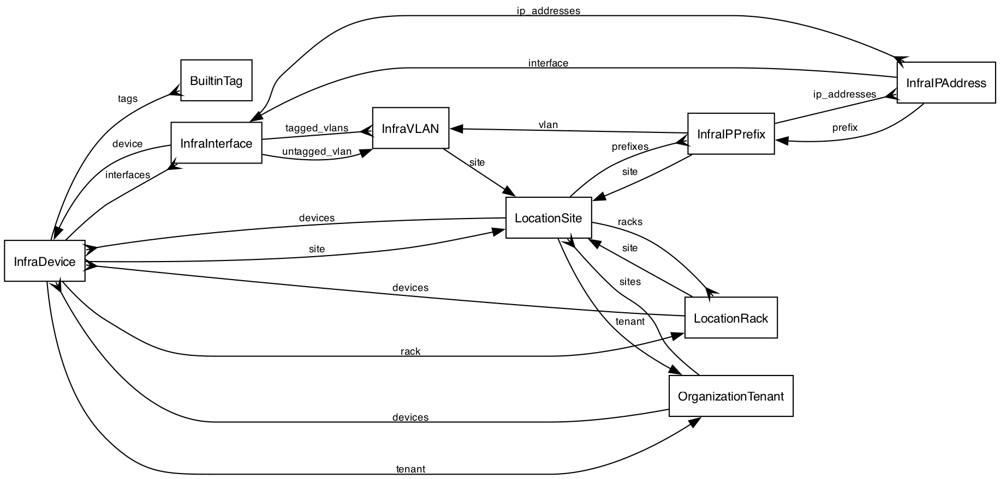

# infrahub-erd

entity-relationship diagrams for infrahub.

## features

- fetches graphql schema from a live infrahub instance
- reads schema from a local `.graphql` file
- renders entity relationships as graphviz dot, mermaid, plantuml, or d2
- shows attributes and relationship cardinality (one vs. many)
- draws infrahub generics (graphql interfaces) and the relationships that target them
- lists the allowed values of enum-typed attributes inline (e.g. `Status(ACTIVE,INACTIVE)`)
- branch-aware schema fetch

## example



generated from [examples/demo-schema.graphql](examples/demo-schema.graphql):

```bash
infrahub-erd -f examples/demo-schema.graphql --no-attributes | dot -Tpng -Gdpi=150 -o examples/demo.png
```

## docs

- [docs index](docs/index.md)
- [changelog](CHANGELOG.md)

## install

```bash
cargo install infrahub-erd
```

## quick start

from a live infrahub instance:

```bash
infrahub-erd --url http://localhost:8000 --token your-token > schema.dot
dot -Tpng schema.dot -o schema.png
```

from a schema file:

```bash
infrahub-erd --schema-file /path/to/schema.graphql > schema.dot
dot -Tsvg schema.dot -o schema.svg
```

hide attributes to get a cleaner relationship-only diagram:

```bash
infrahub-erd --schema-file schema.graphql --no-attributes > topo.dot
```

## live fetch

these flags apply when fetching from a live instance (not with `--schema-file`).

`--branch` fetches the schema from a specific branch instead of the default:

```bash
infrahub-erd --url http://localhost:8000 --token your-token --branch feature-x > schema.dot
```

`--no-ssl-verify` skips tls certificate verification, e.g. for an instance
behind a self-signed cert:

```bash
infrahub-erd --url https://infrahub.internal --token your-token --no-ssl-verify > schema.dot
```

## environment variables

| variable | description |
|---|---|
| `INFRAHUB_URL` | infrahub instance url (alternative to `--url`) |
| `INFRAHUB_TOKEN` | api token (alternative to `--token`) |

## output

`--format` selects the diagram syntax (default: `dot`):

| `--format` | output |
|---|---|
| `dot` | graphviz dot |
| `mermaid` | mermaid er diagram |
| `plant-uml` | plantuml er diagram |
| `d2` | d2 diagram (sql_table shapes) |

the default dot output pipes straight to `dot` for rendering:

```bash
# png
infrahub-erd -f schema.graphql | dot -Tpng -o schema.png

# svg
infrahub-erd -f schema.graphql | dot -Tsvg -o schema.svg

# pdf
infrahub-erd -f schema.graphql | dot -Tpdf -o schema.pdf
```

select another format with `--format`:

```bash
infrahub-erd -f schema.graphql --format mermaid > schema.mmd
infrahub-erd -f schema.graphql --format plant-uml > schema.puml
infrahub-erd -f schema.graphql --format d2 > schema.d2
```

output goes to stdout by default; `-o` / `--output` writes it to a file instead:

```bash
infrahub-erd -f schema.graphql -o schema.dot
```

## filtering

`--include` and `--exclude` take a regex matched against entity names, to narrow
a large schema down to the entities you care about. relationships pointing to
filtered-out entities are pruned, so no dangling edges remain.

`--include` keeps only entities whose names match:

```bash
# only the infra* entities (drops location*, builtin*, organization*)
infrahub-erd -f schema.graphql --include '^Infra' | dot -Tpng -o infra.png
```

`--exclude` drops entities whose names match:

```bash
infrahub-erd -f schema.graphql --exclude '^Builtin'
```

both together apply include first, then exclude:

```bash
# infra* entities, minus interfaces
infrahub-erd -f schema.graphql --include '^Infra' --exclude 'Interface$'
```

## development

```bash
cargo build
cargo test
cargo clippy --all-targets --all-features
cargo fmt --all
```
